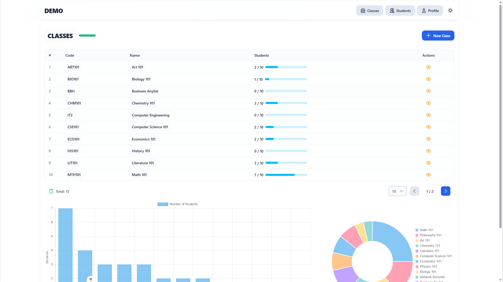

#### **WEB FULLSTACK TRAINNING TEMPLATE 2025**

**GIT** [notebook](../git/docs.ipynb)  
- Linux commands
- Git  
- Git flow  

**WEB BASIC** [notebook](../web-basic/docs.ipynb)  
- HTML 
- JS, TS  
- CSS, TAILWIND CSS, BOOTSTRAP  
- NODEJS  

**VUE3** [notebook](../vuejs/docs.ipynb)  
- VueJS Setup
- Attributes Binding, Event handling
- Composition API   
- Code organazation, lifecycle  
- Pinia,...

**NEST** [notebook](../nestjs/docs.ipynb)  
- Nest Setup
- Route, Midleware,...
- Code organazation, lifecycle
- Database, migrations
- Authentication, Authorization
- Exception handling

**DOCKER** [notebook](../docker/docs.ipynb)  
- Docker: image, container, volume, network 
- Dockerfile
- Docker compose
- Docker network

**DEMO** | Student/Class management  
Landing page  
  
Auth  
  
Class  
  
Students  
  
Theme: Darkmode  
 